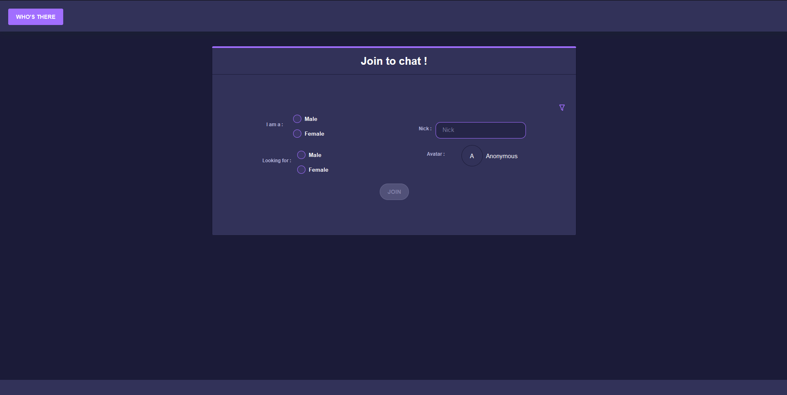
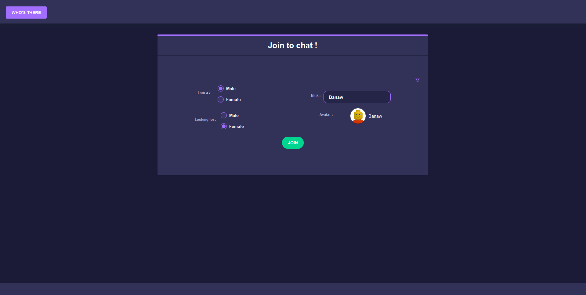
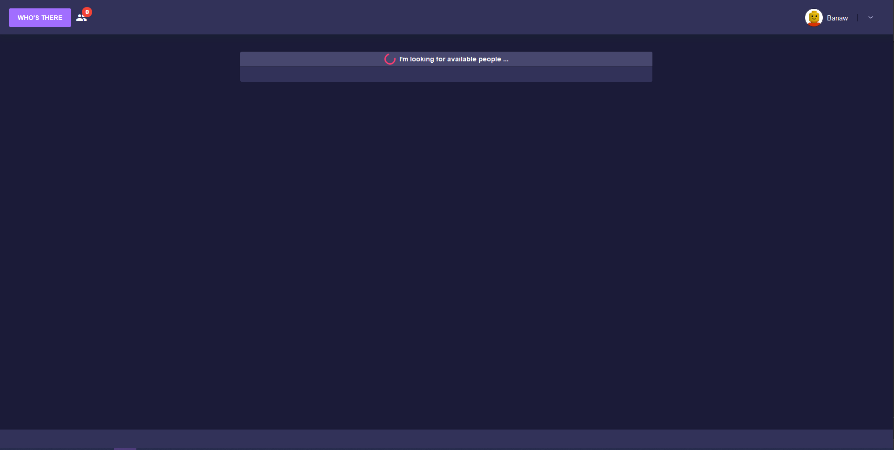
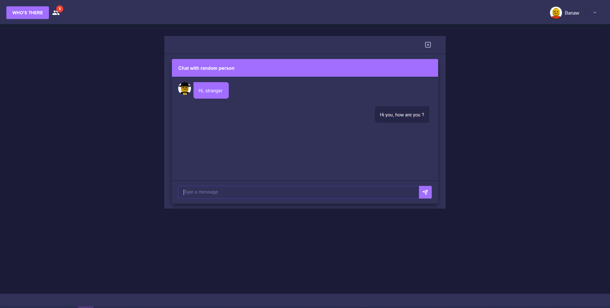
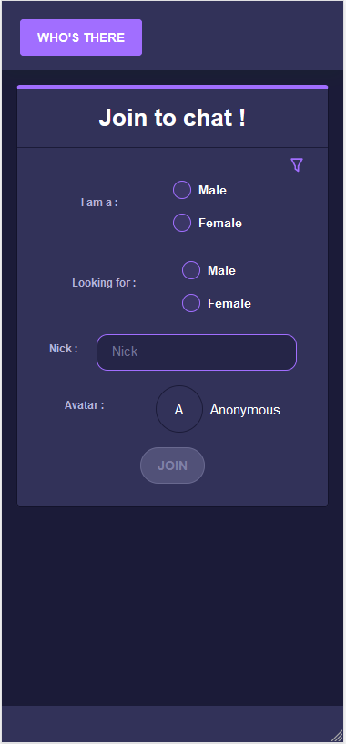
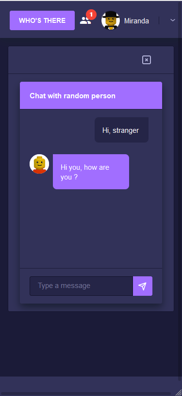

# WhosThere
Web chat app with random people

## Technologies :

#### API : 
- .Net Core 5
- ASP .NET Core
- SignalR
- Entity Framework
- Fluent API
- LINQ
- PostreSQL / SQLite

#### Client :
- Angular 11+
- Nebular - library
- RxJS
- TypeScript
- HTML
- CSS / SCSS

## Demo 
The project is published on Heroku. You can try it out clicking by this [link](https://whosthere-banaw.herokuapp.com/)

### Screen shots

#### PC view

#### Mobile View

